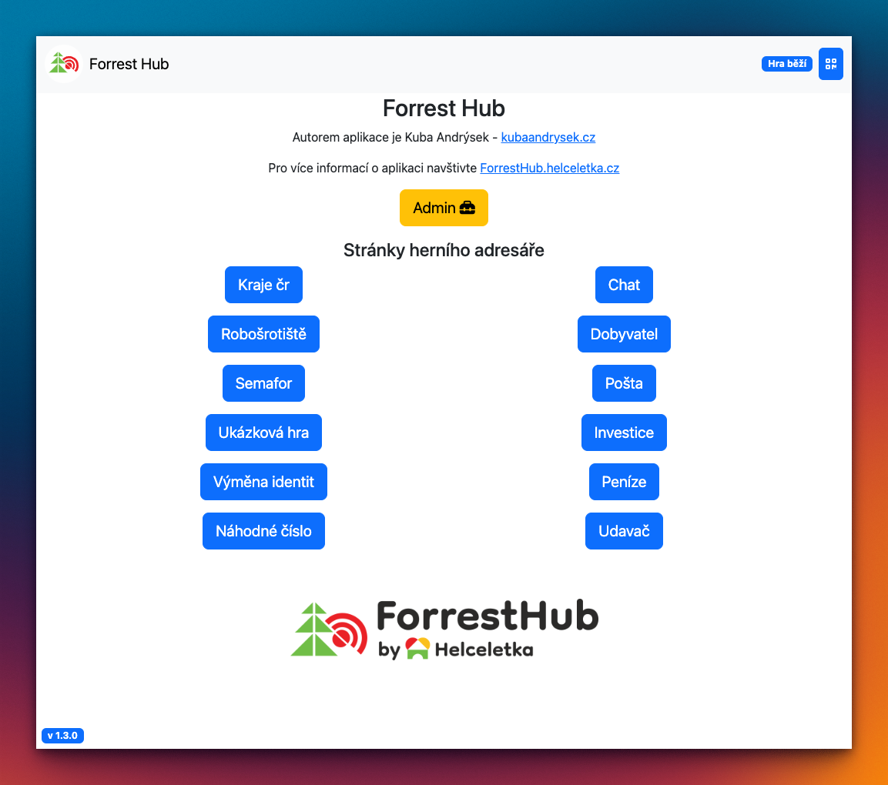

	

    

# ForrestHub

## 🇨🇿 Co je ForrestHub?

🎮 **ForrestHub** je **open-source webová platforma** pro návrh a hraní **multiplayerových her**. Hráči mohou interagovat mezi sebou i se systémem v reálném čase.
Podporuji vývoj **outdoorových her s technickými prvky**, které propojují reálný svět s digitálním.

### 🚀 Hra připravena do 2 minut
- Stáhni si [`ForrestHub.exe`](https://forresthub.helceletka.cz/install/) nebo [`ForrestHub-macOS`](https://forresthub.helceletka.cz/install) a hraj!
- [:arrow_forward: Stáhnout](https://forresthub.helceletka.cz/install)

### 🤖 AI ti vygeneruje hry
- Využij náš předtrénovaný model a vygeneruj si **hru na míru**.
- [:arrow_forward: Generování her](https://forresthub.helceletka.cz/game)

### 🎮 Užij si multiplayer s přáteli
- Hra je primárně navržena pro **hraní na více zařízeních**.
- [:arrow_forward: Multiplayer](https://forresthub.helceletka.cz/connection)

### 🔓 Open Source
- Celý projekt je open-source a dostupný pod licencemi:
  - **GNU GPL v3.0** (pro zdrojový kód)
  - **CC BY-SA 4.0** (pro herní materiály)
- [:arrow_forward: License](https://forresthub.helceletka.cz/license)

English version is down below 👇

## 🔥 Ukázky

---

🇬🇧 English version

## 🇬🇧 What is ForrestHub?

🎮 **ForrestHub** is an **open-source web platform** designed for **multiplayer game development and play**.
Players can interact with each other and the system in real-time.

My focus is on supporting the development of **outdoor games with technical elements**, connecting the physical and digital worlds.

### 🚀 Game Ready in 2 Minutes
- Download [`ForrestHub.exe`](install) or [`ForrestHub-macOS`](install) and start playing!
- [:arrow_forward: Download](https://forresthub.helceletka.cz/install)

### 🤖 AI Generates Games for You
- Use our pre-trained model to generate a **custom game**.
- [:arrow_forward: Generate a Game](https://forresthub.helceletka.cz/game)

### 🎮 Enjoy Multiplayer with Friends
- Designed primarily for **multi-device play**.
- [:arrow_forward: Multiplayer](https://forresthub.helceletka.cz/connection)

### 🔓 Open Source
- The entire project is open-source and licensed under:
  - **GNU GPL v3.0** (for source code)
  - **CC BY-SA 4.0** (for game materials)
- [:arrow_forward: License](https://forresthub.helceletka.cz/license)

## 🔥 Screenshots

---

## 🔗 Useful Links

- 🌍 **Website**: [ForrestHub](https://forresthub.helceletka.cz/)
- 💻 **GitHub Repository**: [ForrestHub on GitHub](https://github.com/Helceletka/ForrestHub)
- 🧑‍💻 **Author**: [Jakub Andrýsek](https://kubaandrysek.cz/)

📜 **License:**
- **Source Code**: [GNU GPL v3.0](https://www.gnu.org/licenses/gpl-3.0.html)
- **Game Materials**: [CC BY-SA 4.0](https://creativecommons.org/licenses/by-sa/4.0/)

🚀 Enjoy open-source multiplayer gaming!

