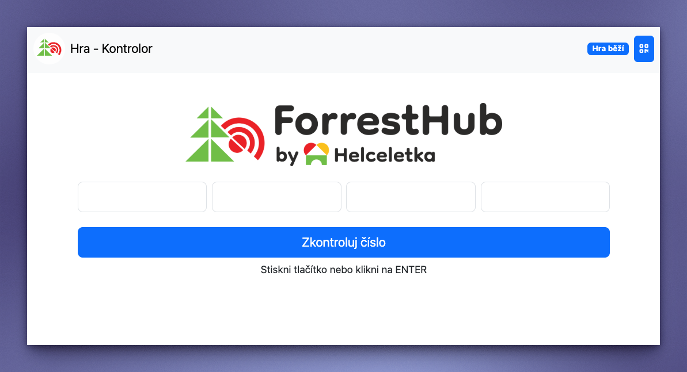
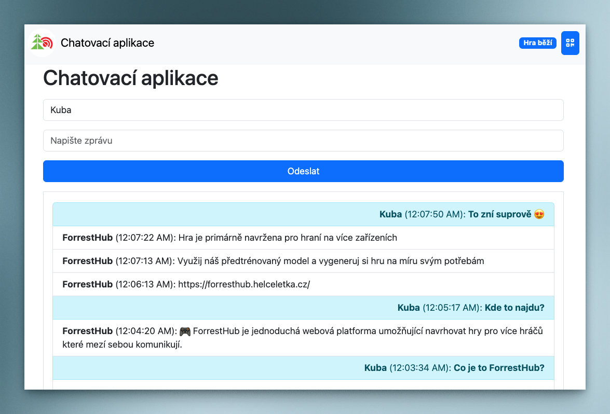

# ForrestHub

🎮 ForrestHub is a simple web platform allowing you to design multiplayer games that communicate over a local network.

Download the latest version of the ForrestHub app:
- [Windows](https://github.com/Helceletka/ForrestHub/releases/latest/download/ForrestHub-Windows.exe)
- [Mac OS X](https://github.com/Helceletka/ForrestHub/releases/latest/download/ForrestHub-macOS)

## Screenshots

## Features
- AI fine-tuned model for generating games
- Multiplayer support
- Open Source
- Easy to use
- Fast game setup
- Cross-platform

## More information
- [Website](https://forresthub.helceletka.cz/)
- [Author - Jakub Andrýsek](https://kubaandrysek.cz/)
- [Helceletka.cz](https://helceletka.cz/)

## License
This project is licensed under the MIT License - see the [LICENSE](LICENSE) file for details.
