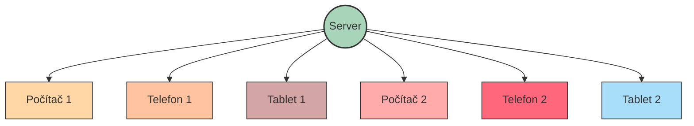

Systém ForrestHub je navržen tak, aby byl hrán na více zařízeních.
Hra se spustí na jednom počítači, který slouží jako server.
Podmínkou je, že všechna zařízení jsou připojena do stejné Wi-Fi sítě.

Níže je zobrazen graf, který znázorňuje propojení serveru s jednotlivými zařízeními.

