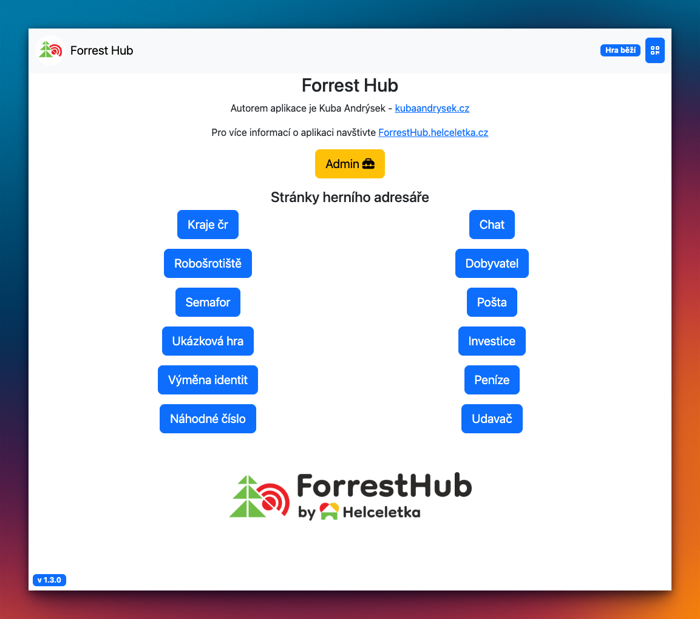
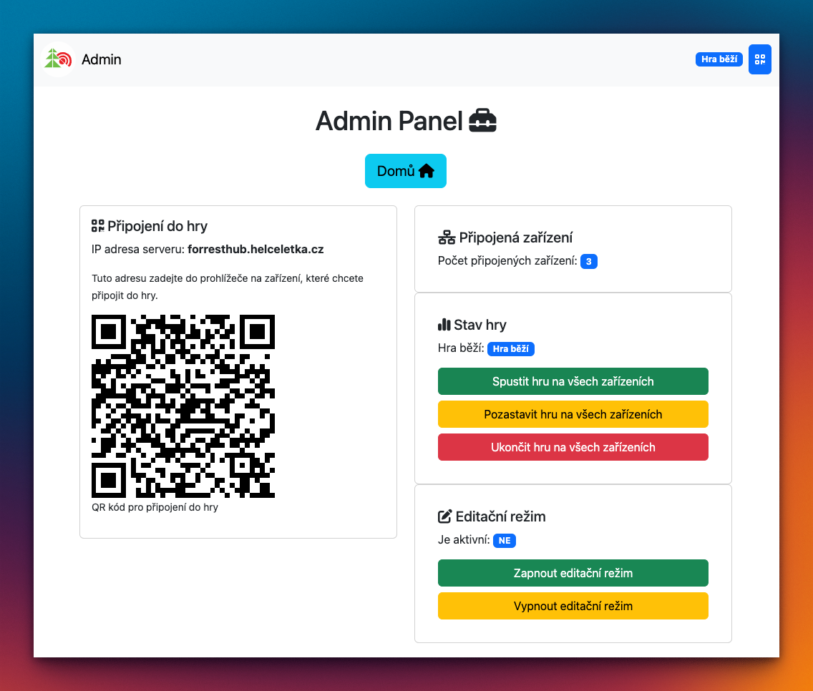
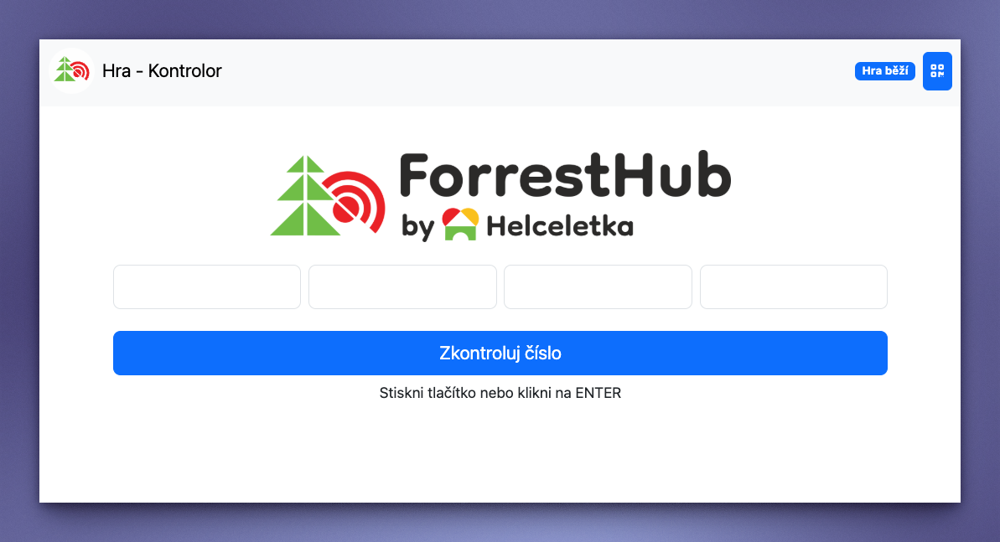
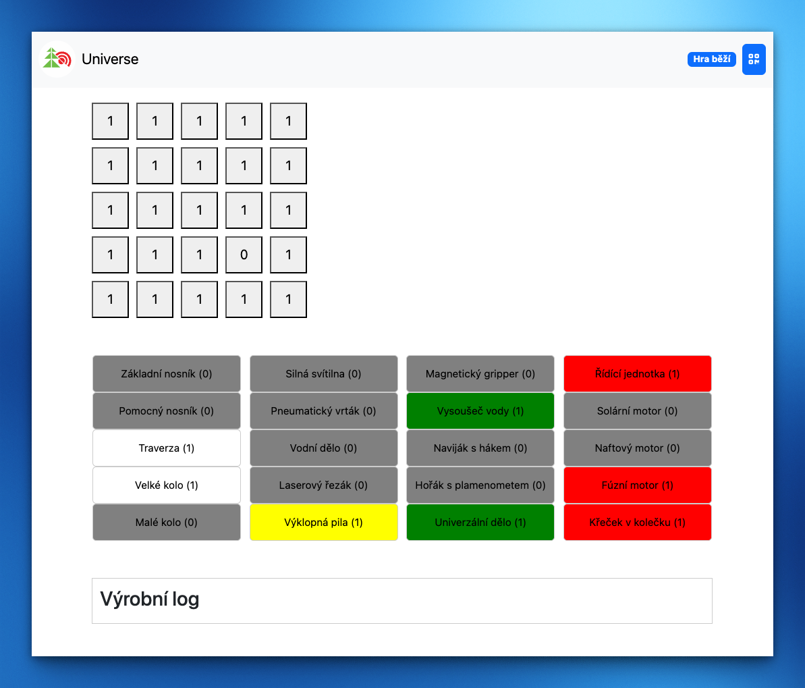
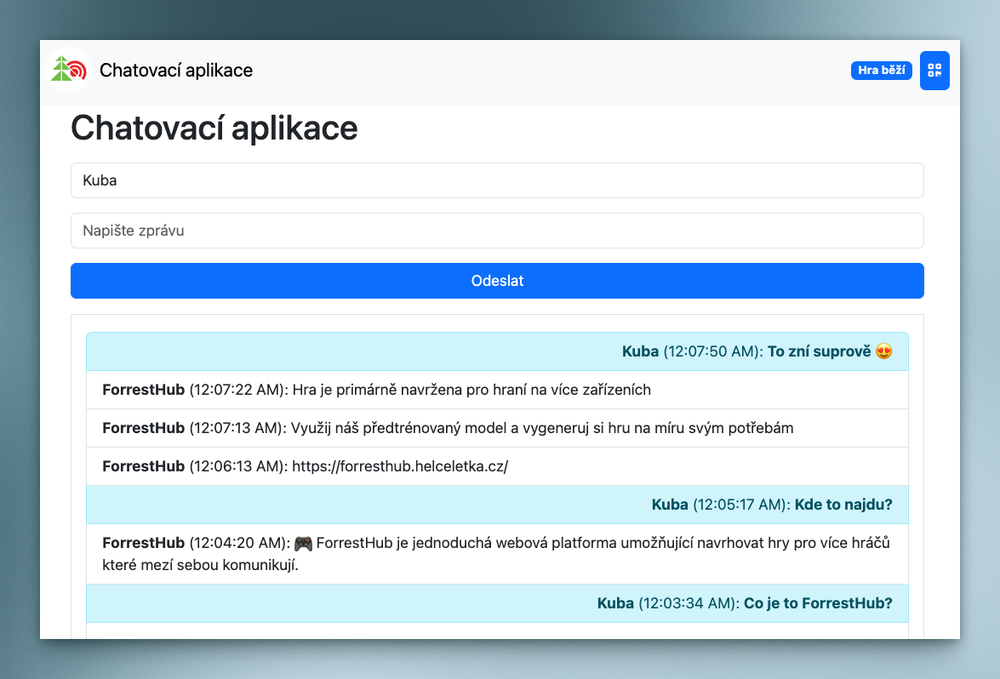

<a href="https://helceletka.cz/" target="_blank" rel="noopener">
    <figure markdown="span">
        { width="500" }
    </figure>
</a>

    

## Co je ForrestHub?

!!! info ""

    🎮 ForrestHub je jednoduchá webová platforma umožňující navrhovat hry pro více hráčů které mezí sebou komunikují.

-   :material-clock-fast:{ .lg .middle } __Hra je připravena do 2 minut__

    ---

    Stáhni si [`ForrestHub.exe`](install) nebo [`ForrestHub-macOS`](install) a hraj!

    [:octicons-arrow-right-24: Stáhnout](install)

-   :fontawesome-solid-robot:{ .lg .middle } __AI ti vygeneruje hry__

    ---

    Využij náš předtrénovaný model a vygeneruj si hru na míru svým potřebám

    [:octicons-arrow-right-24: Generování her](game)

-   :fontawesome-solid-gamepad:{ .lg .middle } __Užij si multiplayer s přáteli__

    ---

    Hra je primárně navržena pro hraní na více zařízeních

    [:octicons-arrow-right-24: Multiplayer](connection)

-   :material-scale-balance:{ .lg .middle } __Open Source__

    ---

    Celý projekt je open source a je dostupný pod licencemi GNU GPL v3.0 (pro zdrojový kód) a CC BY-SA 4.0 (pro herní materiály).

    [:octicons-arrow-right-24: License](license)

## Ukázky

